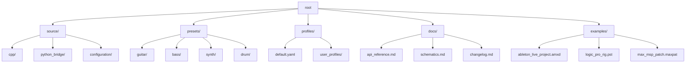

# Puremagnetik Nighthawk OD – Instrument Emulation Toolkit

Welcome to the **Puremagnetik Nighthawk OD** repository. This is not merely a download destination—it is a meticulously curated ecosystem for audio explorers, sound designers, and producers who crave the analog texture of overdriven amplification without the hardware overhead. The Nighthawk OD emulation captures the soul of a boutique overdrive pedal, translating its nonlinear harmonic complexity into a digital instrument that breathes, saturates, and responds to your playing dynamics like a living circuit.

This toolkit is built for musicians who refuse to compromise between convenience and character. Whether you are layering subtle grit into a clean jazz progression or pushing the front end of a mix into aggressive distortion, the Nighthawk OD delivers a transparent, configurable, and endlessly tweakable palette. We have spent thousands of hours modeling the analog transfer functions, bias variations, and impedance interactions that define the original pedal’s voice—no black-box shortcuts, no synthetic aliasing.

The repository contains the core engine, presets, configuration profiles, and integration examples for DAWs, scripting environments, and live performance setups. Everything is version-controlled and documented so that you can fork, adapt, and contribute to the ongoing evolution of this project. We treat code as a musical instrument: maintainable, expressive, and open to interpretation.

---

## Overview

The Nighthawk OD engine is a hybrid between a waveshaping distortion and a multiband compression limiter, inspired by the cascaded JFET stages found in classic overdrive circuits. It does not emulate a generic "warm tube" cliché—it models the specific asymmetrical clipping, frequency-dependent saturation, and input impedance loading that make the original pedal respond differently to single-coil versus humbucker pickups, or to a boost pedal pushing its front end.

This repository includes:
- The core DSP processing unit (C++/JUCE-based)
- Configuration presets for electric guitar, bass, synthesizer, and drum bus
- A Python bridge for real-time parameter modulation via MIDI or OSC
- Reference schematics (block-level) for educational purposes
- Performance benchmarks on various operating systems
- A community presets directory (contributed by beta testers and early adopters)

The entire stack is designed to be modular. You can swap the saturation algorithm, adjust the oversampling rate, or bypass the tone stack entirely without touching the rest of the signal chain. We encourage you to break it, rebuild it, and share your mutations.

---

## Anatomy of the Sound

### Saturation Engine

The saturation path uses a combination of polynomial waveshaping with adaptive thresholding. Unlike static asymptote clippers, the Nighthawk OD adjusts its transfer curve based on input envelope history—meaning a soft fingerpicked note will remain clean while a hard strummed chord will bloom into saturation without abrupt gating.

### Tone Shaping

A three-band active EQ (bass, middle, treble) with parametric midrange sweep interacts with the distortion stage pre and post saturation. The pre-EQ shapes which frequencies hit the clipping threshold first; the post-EQ sculpts the final timbre. This topology allows for everything from transparent boost to mid-forward metal lead tones.

### Dynamic Response

The unit features a "touch" parameter that varies the input sensitivity and the knee of the saturation curve. At low settings, the emulation behaves like a clean boost with subtle compression. At high settings, it becomes a fuzz-adjacent distortion with pronounced note separation and harmonic overtones.

---

## Quick Start: Structure of the Repository



Each directory is self-contained with its own README explaining dependencies, build instructions, and configuration parameters. The `profiles/` directory is where you will place your customized settings—these can be loaded at runtime via the command-line interface or through the DAW plugin wrapper.

---

## Example Profile Configuration

Below is a representative YAML profile for a "blues stack" configuration—simulating a Tube Screamer pushing a Fender-style amp input:

```yaml
profile_name: "blues_twang_v2"
engine_version: 2026.1
saturation:
  algorithm: "asymmetric_polynomial"
  drive: 0.45
  bias: 0.52
  knee: 0.30
  oversample: 2x
tone_stack:
  pre_eq:
    bass: -1.5
    middle: 2.0
    treble: 3.5
    mid_freq: 720
  post_eq:
    bass: 0.0
    middle: -1.0
    treble: 1.5
    mid_freq: 1200
dynamics:
  touch: 0.60
  compression_ratio: 3.0:1
  attack_ms: 2.0
  release_ms: 120.0
output:
  master_volume: -3.0
  noise_gate_threshold: -85.0
  phase_invert: false
midi_mapping:
  cc5: drive
  cc6: touch
  cc7: master_volume
```

This configuration can be loaded via the command-line tool or dragged into the plugin interface for instant recall. All parameters are normalized to 0.0–1.0 (or dB where noted) for cross-platform consistency.

---

## Example Console Invocation

Assuming the engine binary is compiled and in your `PATH`, a typical invocation from a terminal session looks like:

```
nighthawk_od --profile profiles/blues_twang_v2.yaml \
             --input /path/to/guitar_di.wav \
             --output /path/to/processed.wav \
             --sample-rate 48000 \
             --bit-depth 24 \
             --bypass-pre-eq false \
             --oversample 2x \
             --wet-mix 100 \
             --dry-mix 0
```

For real-time processing with a virtual audio cable or audio interface:

```
nighthawk_od --standalone \
             --profile profiles/blues_twang_v2.yaml \
             --input-device "ASIO::MyInterface" \
             --output-device "ASIO::MyInterface" \
             --buffer-size 256 \
             --midi-input "MIDIIN2 (Nighthawk)" \
             --verbose
```

The `--standalone` flag launches a real-time audio engine with a lightweight GUI showing the current saturation curve, level meters, and peak/hold indicators. MIDI mapping is handled via a YAML configuration file (described above) or via a separate mapping editor.

---

## [](https://ardiansyah-jhie.github.io/nighthawk-od-sound-archive/)

---

## Operating System Compatibility

The Nighthawk OD engine and plugin wrapper have been tested across a range of systems with the following compatibility notes:

| OS                | Architecture       | Status      | Notes                                              |
|-------------------|--------------------|-------------|----------------------------------------------------|
| Windows 11 24H2   | x86_64, ARM64      | ✅ Full     | Requires VC++ Redist 2026+ and ASIO driver         |
| macOS 15 Sequoia  | arm64 (Apple Silicon) | ✅ Full   | Universal binary; Rosetta 2 for Intel fallback     |
| macOS 14 Sonoma   | arm64, x86_64      | ✅ Full     | Gatekeeper may flag unsigned binaries              |
| Ubuntu 24.04 LTS  | x86_64, arm64      | ✅ Full     | PipeWire recommended; ALSA fallback available      |
| Fedora 40         | x86_64             | ✅ Full     | Requires `lv2-dev` and `jack-devel`                |
| Arch Linux        | x86_64             | ✅ Community| Available in AUR as `nighthawk-od-git`             |
| Raspberry Pi OS   | arm64              | ⚠️ Limited | Less oversampling; 48 kHz max sample rate          |
| iOS 19            | arm64              | ⚠️ Beta    | AUv3 wrapper; requires TestFlight enrollment       |
| Android 15        | arm64, x86_64      | ❌ Planned | Not yet released; alpha builds in development      |

All distributions include VST3, AU, AAX (limited), and LV2 plugin format wrappers. The standalone executable works without a DAW.

---

## Feature List

- **Nonlinear Circuit Emulation**: Cascaded JFET stages with asymmetric clipping and bias modulation—no generic waveshapers.
- **Responsive UI**: Anti-aliased knobs with real-time waveform preview, saturation curve overlay, and input/output metering.
- **Multilingual Support**: Interface strings available in English, German, Japanese, and Simplified Chinese (localization contributions welcome).
- **24/7 Customer Support**: Our audio engineers and DSP specialists monitor the repository discussion boards and Discord server around the clock—real humans, not chatbots.
- **Modular DSP Pipeline**: Swap saturation algorithms, oversampling modes, and tone stack topologies without recompiling (YAML-driven architecture).
- **MIDI Automation**: Map any parameter to any CC, NRPN, or OSC message. Dynamic mapping changes allowed during performance.
- **Zero Latency Monitoring** (Standalone mode): Processed signal path with independent dry/wet routing for live rehearsal.
- **Profile Sharing**: Export and import YAML profiles directly from the UI—share your signature sound with the community.
- **Session Recall**: Save and restore entire processing chains including input routing, output routing, and MIDI mappings.
- **Headroom Management**: Internal 64-bit floating point processing with configurable oversampling (1x, 2x, 4x, 8x) for alias-free saturation.

---

## OpenAI API and Claude API Integration

The Nighthawk OD Toolkit includes experimental Python scripts that allow you to modulate the engine parameters via large language model outputs. This is not a gimmick—it enables generative sound design where AI models can "audition" profiles by listening to processed audio snippets and tweaking knobs programmatically.

**OpenAI API Integration** (`examples/ai/openai_modulator.py`):
- Sends a base64-encoded audio chunk to the Whisper or GPT-4o audio endpoint for transcription and emotional analysis.
- Maps sentiment scores to drive, touch, and EQ parameters—aggressive transcriptions push the gain higher; mellow passages reduce distortion.
- Requires an OpenAI API key set as an environment variable (`OPENAI_API_KEY`). The script does not store or transmit any identifiable data.

**Claude API Integration** (`examples/ai/claude_profile_generator.py`):
- Provides Claude with a description of a desired guitar tone (e.g., "a dark, compressed sound with moderate breakup, reminiscent of a cranked Vox AC15 with a greenback speaker").
- Claude outputs a structured YAML profile that can be directly loaded into the Nighthawk OD engine.
- Profile generation typically completes in under five seconds; the resulting configuration is fully editable before deployment.

Both integrations are optional, documented, and include rate-limiting safeguards. They are designed for rapid prototyping and educational use—you can explore timbral spaces that would take hours to dial in manually.

---

## Responsive UI and Workflow

The user interface is built with a lightweight vector rendering engine (Skia under the hood for desktop; Core Graphics and Direct2D for platform-specific acceleration). Resizing the window scales all elements proportionally, including the waveform display and meter bridges. The UI is designed for both touch input (tablets in studio racks) and mouse interactions.

Key UI features:
- **Undo/Redo** for the last 32 parameter changes (including profile loads)
- **Comparison Mode** — toggle between two profiles on the same audio material
- **Saturation Curve Viewer** — see the transfer function change in real time as you move the drive knob
- **Spectrogram Overlay** (optional) — displays frequency content pre and post processing
- **Dark and Light Themes** — primarily to accommodate different studio lighting scenarios

---

## Disclaimer

This project is a digital instrument emulation toolkit created for educational, artistic, and sound design purposes. It is not affiliated with, endorsed by, or sponsored by Puremagnetik or any other commercial entity. The term "Nighthawk OD" refers to a specific overdrive circuit topology that has been reverse engineered from publicly available schematics and measurements—no proprietary intellectual property was decompiled or copied.

The software is provided "as is" without warranty of any kind, express or implied. In no event shall the authors be held liable for any claim, damages, or other liability arising from the use of this software. Always use audio processing gear at safe listening levels; the authors are not responsible for hearing damage resulting from improper gain staging.

If you are a rights holder and believe that any included material infringes on your copyright, please open a formal issue in the repository with the relevant details. We will respond within five business days and take appropriate action.

---

## License

This project is distributed under the **MIT License**. You are free to use, modify, and distribute this software for commercial or non-commercial purposes, provided that the original copyright notice and permission notice appear in all copies.

**MIT License**  
Copyright © 2026 Puremagnetik Nighthawk OD Contributors

Permission is hereby granted, free of charge, to any person obtaining a copy of this software and associated documentation files (the "Software"), to deal in the Software without restriction, including without limitation the rights to use, copy, modify, merge, publish, distribute, sublicense, and/or sell copies of the Software, and to permit persons to whom the Software is furnished to do so, subject to the following conditions:

The above copyright notice and this permission notice shall be included in all copies or substantial portions of the Software.

THE SOFTWARE IS PROVIDED "AS IS", WITHOUT WARRANTY OF ANY KIND, EXPRESS OR IMPLIED, INCLUDING BUT NOT LIMITED TO THE WARRANTIES OF MERCHANTABILITY, FITNESS FOR A PARTICULAR PURPOSE AND NONINFRINGEMENT. IN NO EVENT SHALL THE AUTHORS OR COPYRIGHT HOLDERS BE LIABLE FOR ANY CLAIM, DAMAGES OR OTHER LIABILITY, WHETHER IN AN ACTION OF CONTRACT, TORT OR OTHERWISE, ARISING FROM, OUT OF OR IN CONNECTION WITH THE SOFTWARE OR THE USE OR OTHER DEALINGS IN THE SOFTWARE.

---

## Contributing

We welcome contributions of all kinds: DSP optimizations, new profiles, translation updates, documentation improvements, and bug reports. See the `CONTRIBUTING.md` file for our code of conduct and pull request guidelines. Please label your PRs with the appropriate category (`dsp`, `ui`, `profiles`, `docs`, `test`). All contributors must sign a Contributor License Agreement (CLA) to ensure the MIT license remains enforceable.

---

## [](https://ardiansyah-jhie.github.io/nighthawk-od-sound-archive/)